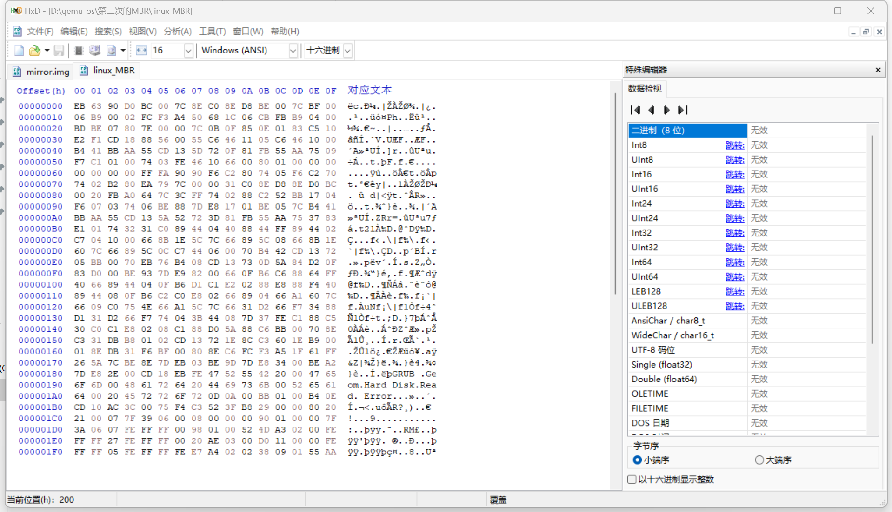
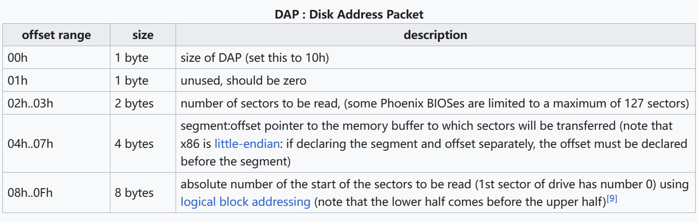

# PA1实验报告

## 虚拟机创建与操作系统安装过程描述

1. 安装qemu(windows)，并创建虚拟磁盘，指令如下：

``````
qemu-img create -f raw mirror.img 30G
``````
&ensp;&ensp;&ensp;&ensp;指令中指定了格式为raw，大小为30G

2. 分别下载Windows 10镜像和ubuntu22.04.4镜像

3. 首先安装Windows 10系统

&ensp;&ensp;&ensp;&ensp;安装Windows 10的指令如下:
```
qemu-system-x86_64 -m 6G -smp 4 -boot once=d -drive file=mirror.img ^ 
-cdrom D:\develop\iso\SW_DVD9_Win_Pro_10_21H1_64BIT_ChnSimp_Pro_Ent_EDU_N_MLF_X22 ^
-55090.ISO
```

&ensp;&ensp;&ensp;&ensp;分别指定了虚拟机内存为6G，4核，镜像地址等信息。

&ensp;&ensp;&ensp;&ensp;并在Windows 10系统中打开磁盘管理，将C盘进行“压缩卷”操作，得到一部分未分配空间，用于后续Linux系统安装。
4. 安装Linux系统(Ubuntu)

&ensp;&ensp;&ensp;&ensp;安装指令如下：
```
qemu-system-x86_64 -m 6G -smp 4 -boot once=d -drive file=mirror.img ^ 
-cdrom D:\develop\iso\ubuntu-22.04.4-desktop-amd64.iso
```
&ensp;&ensp;&ensp;&ensp;与安装Windows 10的指令比，只有镜像地址改变
&ensp;&ensp;&ensp;&ensp;为了将Ubuntu安装在指定分区，有以下两步需要选择，选择“其他选项”，并且“编辑分区”，设置Ext4文件系统和挂载点：


5. 到此为止，两个系统安装完成，使用如下指令启动：
```
 qemu-system-x86_64 -bios D:\develop\qemu\share\bios.bin -m 6G -hda mirror.img -smp 4
```

&ensp;&ensp;&ensp;&ensp;正常出现的界面如下：

&ensp;&ensp;&ensp;&ensp;如果Windows 10或者Linux系统有无法正常启动(如启动引导器安装位置不对)，或者其中一个系统被覆盖，则需要重新安装。

## 读取虚拟磁盘的MBR

&ensp;&ensp;&ensp;&ensp;使用HxD软件读取之前创建的虚拟硬盘mirror.img的MBR

&ensp;&ensp;&ensp;&ensp;在打开中选中mirror.img即可。我分别在安装完Windows 10和安装完两个系统之后都读取了一下MBR，结果分别如下：




## 反汇编及MBR结构分析

### MBR整体结构及反汇编

MBR共由以下各部分组成：

1. 引导程序，440个字节
2. 磁盘签名，4字节
3. 保留字节：2字节
4. 分区表，64字节，每16字节为一个分区
5. 结束标志，2个字节，通常为“55AA”

下面对最重要的两部分：引导程序和分区表分别进行分析

使用nadisasm将两段引导程序反汇编成汇编语言，格式为intel 16bit格式，使用指令如下：

```
ndisasm -b 16 D:\qemu_os\win_MBR.bin > D:\qemu_os\win_MBR.asm

ndisasm -b 16 D:\qemu_os\linux_MBR.bin > D:\qemu_os\linux_MBR.asm
```

### MBR之前的准备工作

1. BIOS启动，将主引导扇区(MBR)加载到内存0x7c00的位置，然后交给MBR进行引导。  
2. 所以，MBR启动时，CS一般为0x07c0，IP为0x0000，对应物理地址0x7c00

&ensp;&ensp;**在下面的分析中我们默认了以上两点**

### Windows引导程序(前440字节)分析


1. **一些必要的初始化操作，将寄存器和栈顶指针设置为合适的值**
   如"xor ax,ax","mov ss,ax"等语句。
2. **检查引导标志“55AA”字节，即检查扇区的有效性**
   如"cmp bx,0xaa55"。
3. **磁盘参数设置和检验，读取磁盘数据到内存**
   0x71-0x7C处语句,如"mov ah,0x42"等，将磁盘读取相关信息放入寄存器，"int 0x13",实现了中断，INT 0x13是用于执行磁盘和其他块设备的输入/输出（I/O）操作的BIOS中断。
4. **检查硬件状态**
   大量的条件转移语句，jc,jz语句时刻检查寄存器标志位的设置是否正确。"mov cx,0x4"语句表示最多四个分区
5. **将MBR加载到内存中，开始操作系统的引导启动(最重要)**
   0x4,0xB,0xE处语句分别在SP,SI,DI寄存器种设置了MBR加载的栈指针，源索引和目的索引，0x11-0x15执行了MBR的拷贝，将MBR拷贝到0x7c00处。0x7C00是个内存地址，通常用于存放主引导记录（MBR）的内容。在计算机启动时，BIOS会将磁盘上的MBR加载到内存的这个地址处，并将控制权转移到该地址，以启动操作系统的引导过程。
6. **中断(与硬件和用户交互)**
   "int 0x1a"语句用来获取系统时钟计数器的值，"int 0x10"进行屏幕有关方面的设置， "int 0x18"是中断启动, 一旦int 0x18语句触发, 不会继续引导。

### Linux引导程序(前440字节)分析

#### 语句分析

1.

```assembly
00000000  EB63              jmp short 0x65
```

00H + 2 + 63H = 65H
所以IP改为0x0065，即跳转到0x65处的指令
被跳转过去的部分，用于BIOS参数块

2.

```assembly
00000065  FA                cli
```

禁止CPU中断发生，确保当前运行的代码不会被打断

3.

```assembly
00000066  90                nop
00000067  90                nop
```

空操作指令，用于增加稳定时间

4.

```assembly
00000068  F6C280            test dl,0x80
0000006B  7405              jz 0x72
0000006D  F6C270            test dl,0x70
00000070  7402              jz 0x74
00000072  B280              mov dl,0x80
```

dl寄存器没有设置过，为0x0
所以0x68test指令的结果，使ZF=1，则0x6B jz 跳转到0x72，将dl寄存器的值修改为0x80
从含义上来说：
dl寄存器代表驱动器号（80H到FFH）；软驱从0开始，硬盘从80开始。这里是测试启动方式，如果不是80开头，就将80送入dl寄存器。
不同的DL取值对应的结果如下表：
|DL取值|操作|
|-|-|
|0x80|jz 0x72不跳转，jz 0x74跳转|
|0x00|jz 0x72跳转，dl寄存器设置为0x80|
|0x70|jz 0x72跳转，dl寄存器设置为0x80|

5.

```
00000074  EA797C0000        jmp 0x0:0x7c79
```

将CS:IP寄存器改为0x0:0x7c79

6.

```
00000079  31C0              xor ax,ax
0000007B  8ED8              mov ds,ax
0000007D  8ED0              mov ss,ax
0000007F  BC0020            mov sp,0x2000
00000082  FB                sti
```

一些初始化，然后允许CPU中断发生
其中SS:SP=00:2000定义了一个栈空间，ax和ds的值之后会用到

7.

```
00000083  A0647C            mov al,[0x7c64]
00000086  3CFF              cmp al,0xff
00000088  7402              jz 0x8c
```

使用默认的ds寄存器，给出了段地址，合起来为0x0:0x7c64
0x7c64的值为0xff,0xff表示使用启动盘

将cl寄存器的值设为0xff后，进行cmp操作，ZF=1，故jz 0x8c进行转移

8.

```
0000008C  52                push dx
```
dx的值压栈，SP=SP-2=0x1FFE，其中0x1FFE为80，0x1FFF为00，新栈顶为0x1FFE

9.

```
0000008D  BB1704            mov bx,0x417
00000090  F60703            test byte [bx],0x3
00000093  7406              jz 0x9b
```

这里的test语句检查了键盘状态，内存0x0:0x0417属于BIOS Data Area(BDA)，这一区域从400H开始，其中417H处代表键盘状态，具体如下图所示：
 
如果没有shift键按下，则test语句结果为0，ZF=1，jz 0x9b跳转

10.

```
0000009B  BE057C            mov si,0x7c05
0000009E  B441              mov ah,0x41
000000A0  BBAA55            mov bx,0x55aa
000000A3  CD13              int 0x13
```

将 si 寄存器设置为磁盘地址包的地址,ah寄存器代表的是即将执行的中断例程的功能号
将bx寄存器的值设置为0x55aa
引发中断，中断类型码为0x13，ah=0x41，检验扩展功能是否可用，判断 BIOS 是否支持扩展INT 13中断
如果成功，bx=0xaa55，ah=版本号，CF=0
如果失败，bx=0x55aa，ah=1，CF=1
一般现在新的支持LBA模式的主板和Win98自带的DOS7操作系统是支持扩展INT 13的，所以在后续的分析中，我们假定此处判断成功

11.

```
000000A5  5A                pop dx
000000A6  52                push dx
```

%dl 可能已被 INT 13破坏。 例如，在AST BIOS 1.04 中会发生这种情况。所以通过重复出入栈来纠正

12.

```
000000A7  723D              jc 0xe6
```

如果CF=1，说明不支持INT 13中断拓展，则跳转到0xe6，使用CHS

13.

```
000000A9  81FB55AA          cmp bx,0xaa55
000000AD  7537              jnz 0xe6
```

如前所述，如果成功，bx=0xaa55，则ZF=1，jnz 0xe6不跳转
其实也是在判断是否支持INT 13中断拓展

14.

```
000000AF  83E101            and cx,byte +0x1
```

根据维基百科，cx最低位为1，代表：1 – Device Access using the packet structure
byte +0x1 = 0000 0001
and指令后，cx=0x01

15.

```
000000B2  7432              jz 0xe6
```
此时标志位ZF=0，所以不进行跳转

16.

```
000000B4  31C0              xor ax,ax
000000B6  894404            mov [si+0x4],ax
000000B9  40                inc ax
000000BA  8844FF            mov [si-0x1],al
000000BD  894402            mov [si+0x2],ax
000000C0  C7041000          mov word [si],0x10
000000C4  668B1E5C7C        mov ebx,[0x7c5c]
000000C9  66895C08          mov [si+0x8],ebx
000000CD  668B1E607C        mov ebx,[0x7c60]
000000D2  66895C0C          mov [si+0xc],ebx
000000D6  C744060070        mov word [si+0x6],0x7000
000000DB  B442              mov ah,0x42
```

一些初始化，组成磁盘地址数据包，为了第二次引发中断作准备，注意，0x9B处将si寄存器的值设置为0x7c05
具体初始化含义如下：
+ ax=0x0，
+ 0x7c09和0x7c0a写为0，
+ ax自增
+ 0x7c04写为0x01，
+ 0x7c07写为0x01
+ 0x7c05写为0x10
+ ebx是bx的延伸，ebx是32位寄存器，将两个字的数写入ebx寄存器，具体范围如下

+ 将ebx寄存器中的数写入0x7c0d-0x7c10中
+ 再次将两个字的数写入rbx，范围如下：

+ 将ebx寄存器中的数写入0x7c11-0x7c14中
+ 0x7c0b写为00，0x7c0c写为70
+ ah寄存器设为0x42，为下面指定中断类型作准备


17.

```
000000DD  CD13              int 0x13
```

ah=42H，作用为读取磁盘，磁盘地址包的地址为DS:SI = 00:7c05
根据维基百科，磁盘地址包格式如下所示：



结合16.初始化的数据，具体描述如下：

1. 数据包大小为16位，0x7c05为0x10
2. 传输的扇区数，1个

|0x7c05|0x7c07|0x7c08|
|-|-|-|
|0x10|0x01|0x00|

3. 要传输到的扇区的内存缓冲区，0x7000:0x0000

|0x7c09|0x7c0a|0x7c0b|0x7c0c|
|-|-|-|-|
|0x00|0x00|0x00|0x70|

4. 48位起始 LBA 的低 32 位

|0x7c0d|0x7c0e|0x7c0f|0x7c10|
|-|-|-|-|
|0x01|0x00|0x00|0x00|

5. 48位起始 LBA 的高 16 位

|0x7c11|0x7c12|0x7c13|0x7c14|
|-|-|-|-|
|0x00|0x00|0x00|0x00|

最终将将编号80的驱动器（c盘）的第一个扇区读到内存地址0x7000：0x0000处
如果成功，CF=0，否则，CF=1

18.

```
000000DF  7205              jc 0xe6
```

CF=0，不跳转
0xe6是指当磁盘读取失败，则改用CHS寻址模式再尝试

19.

```
000000E1  BB0070            mov bx,0x7000
000000E4  EB76              jmp short 0x15c
```

bx赋值为0x7000，再jmp到0x15c指令处

20.

```
0000015C  60                pusha
0000015D  1E                push ds
```

所有的通用寄存器和ds寄存器入栈

21.

```
0000015E  B90001            mov cx,0x100
00000161  8EDB              mov ds,bx
00000163  31F6              xor si,si
00000165  BF0080            mov di,0x8000
00000168  8EC6              mov es,si
0000016A  FC                cld
0000016B  F3A5              rep movsw
```

首先也是一些初始化，
cx=0x100，bs=0x7000，si=0x0，di=0x8000，es=0x0
cld设置DF=0
0x8000是GRUB引导机内核地址
rep movsw，综合以上的数据初始化，实现了数据的传送

源地址是DS:SI,目的地址是ES:DI，即0x7000:0x0000到0x0000:0x8000
CX=0x100，设置了转移次数
每次操作后，DF=0，则si、di递增

综上，将0x7000:0x0000至0x7000:0x0100之间的内存数据，完整传送到0x0000:0x8000至0x0000:0x8100之间

22.

```
0000016D  1F                pop ds
0000016E  61                popa
```

与上面的入栈对应，这里出栈

23.

```
0000016F  FF265A7C          jmp [0x7c5a]
```

[0x7c5a]的值是0x8000(1个word，16位的地址)
与上面的数据传送对应，即开始执行在00:8000处的内核指令


#### 总结

1. **指令中有大量的跳转**
在开头和结尾，以及每个条件判断语句处，均有大量的跳转，我的分析主要基于qemu虚拟机的硬件结构，跳过了一部分用于处理异常情况的指令
1. **主体部分是两次INT13中断**
第一次中断，ah=41H，用于检验是否支持扩展LBA；第二次中断，ah=42H，用于构造磁盘地址包(DAP)，以扩展LBA格式进行寻址。

### 分区表


#### 结构及含义

1. 第1字节：引导标志，80H表示活动分区，00H表示非活动分区
2. 第2、3、4字节：分区的起始磁头号，扇区号，柱面号  
第2字节表示磁头号，第3字节的低6位表示扇区号，第3字节的高2位与第4字节表示柱面号
3. 第5字节：分区类型
4. 第6、7、8字节：分区结束的磁头号、扇区号、柱面号，具体信息同2.
5. 第9、10、11、12字节，本分区起始扇区偏移量
6. 第13、14、15、16字节，本分区的扇区数


#### 分区情况展示

Windows系统：

Linux(Ubuntu)系统：


+ 与前面安装图片中，虚拟硬盘大小不匹配的原因在于，我的安装过程并不顺利，截图并不是一次安装时截取的，而是多次，每次的虚拟硬盘大小设置不同，但是流程描述和下面的分区表分析都是清晰的。


#### 具体分析

安装Windows 10系统后的分区表如下


安装Linux(Ubuntu)后，分区表如下


通过观察发现，安装Windows 10系统后，仅有三个分区，此时还有一块内存为未分配空间，但不能为windows系统所用，所以还是显示三个分区；然后我在未分配区域安装Ubuntu系统，并设置为逻辑分区(见上文)后，出现了第四个分区。

因为每个分区表的每16个字节表示的分区格式相同，信息类似，所以仅举第一个分区一例，分析如下：

```
 80 20 21 00 07 7F 39 06 00 08 00 00 00 90 01 00
```

表示含义如下：

1. 80表示活动分区
2. 20 = $(0010 0000)_2$ = $(32)_{10}$  
   21 = $(0010 0001)_2$ &ensp;&ensp; $(100001)_2$ = $(33)_{10}$  
   $(0000000000)$ =$(0)_{10}$
   起始扇区为磁头32，扇区33，柱面0
3. 07，表示NTFS分区
4. 分析同上，结束扇区为磁头127，扇区57，柱面6
5. 00080000反过来是00000800，$(2048)_{10}$，起始扇区号为2048
6. 00900100反过来是00019000，$(102400)_{10}$，占有扇区数102400，根据一个扇区512B，有扇区数换算内存大小(G)的公式：   102400/2/1024/1024=$\frac{50}{1024}G=50MB$

其余的分区做相同规则阅读即可。可以发现，分区表中的内容，与windows磁盘管理和Linux中的磁盘信息都是完全对应的。注意，最后两个分区的分区类型，27H表示隐藏的恢复分区，05H表示拓展分区。


