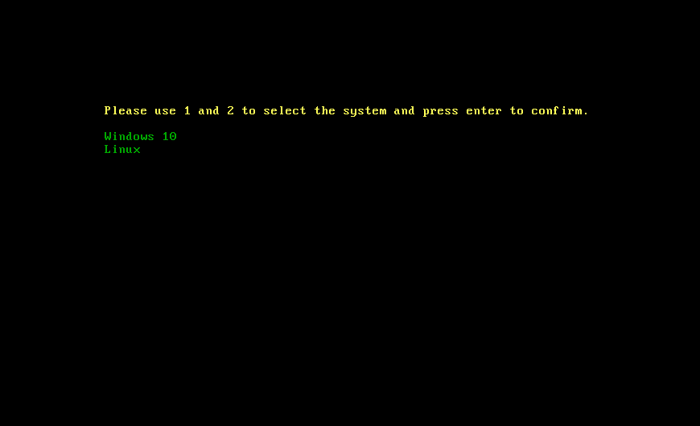
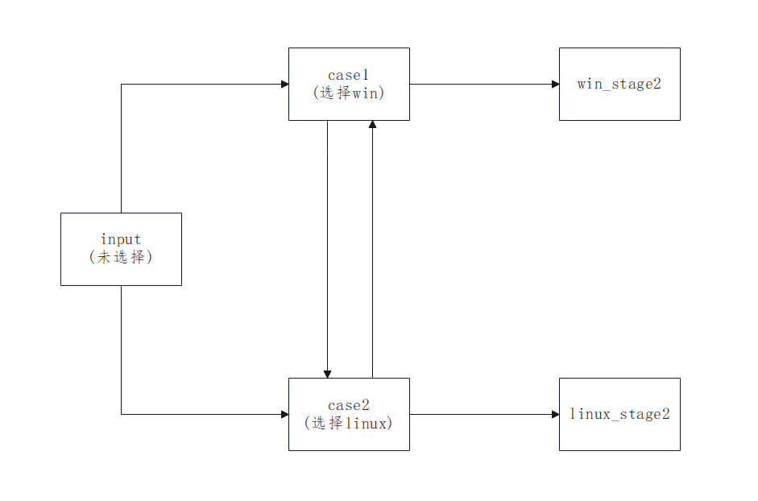
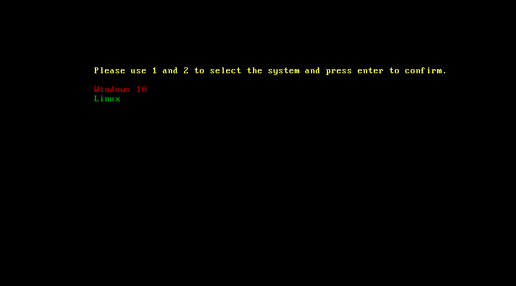
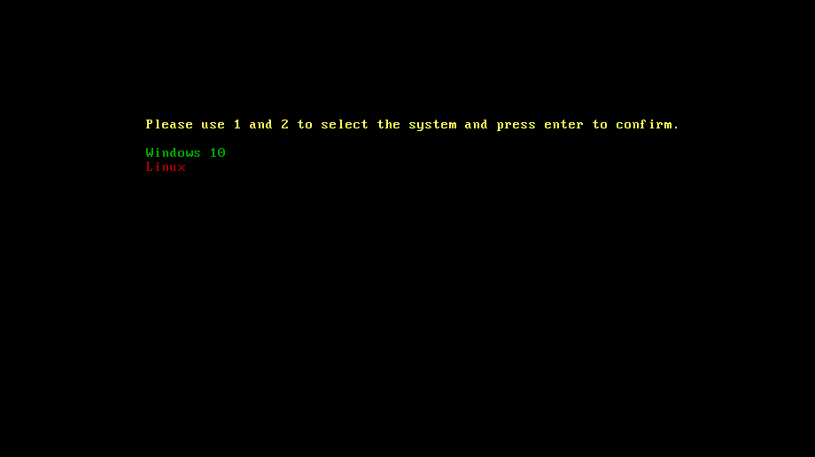
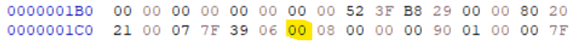
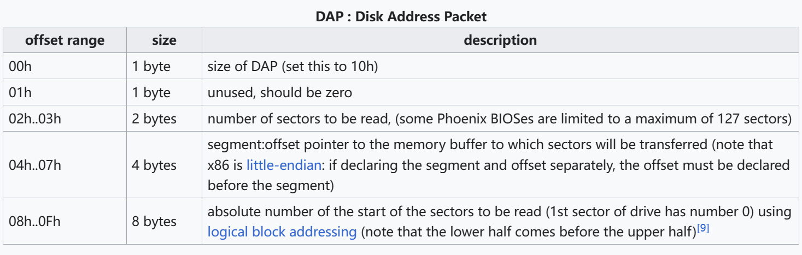
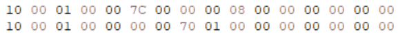
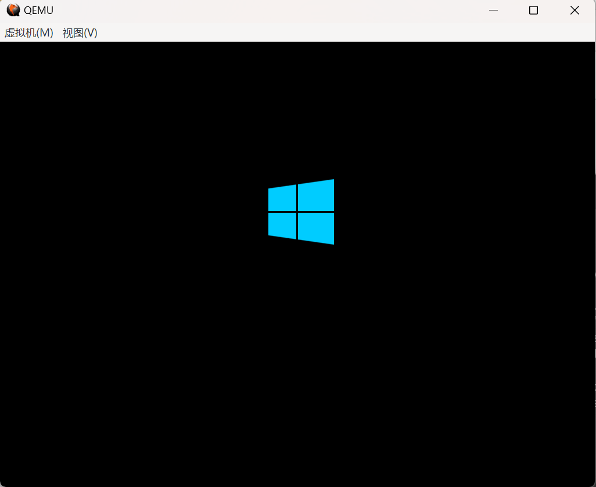
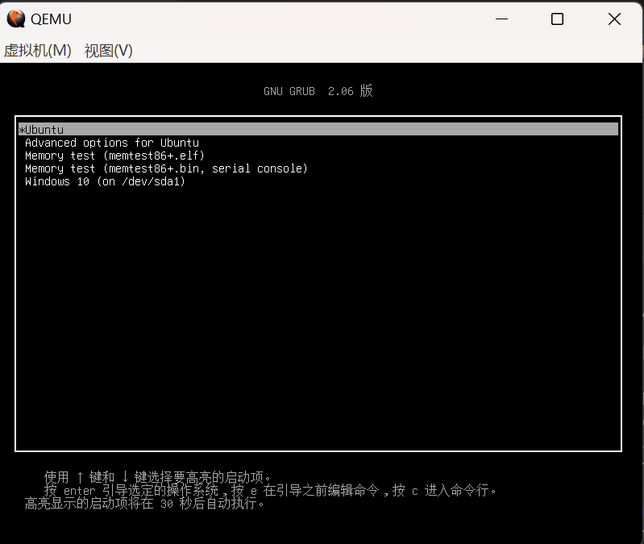

# PA2

## 初始化和MBR复制转移

首先，初始化通用寄存器，并且设置栈指针到0x0:0x7c00

```
mov sp, 0x7c00               
xor ax,ax                 
mov ss,ax                 
mov es,ax                  
mov ds,ax                   
push dx    
```

第二步，需要将MBR从0x0:0x7c00转移到0x0:0x0600位置。这是因为，在windows系统引导stage2阶段时，需要将其从磁盘读取到0x0:0x7c00处，为了防止覆盖掉MBR，所以会先将原来的MBR转移到0x0:0x0600处。

```
mov si,0x7c00                ; 源
mov di, 0x600                ; 目的地
mov cx, 512                  ; 大小(循环次数)
cld                          ; 设置方向(forward)
rep MOVSB                    ; 复制
jmp SKIP + DEST              ; 跳转

SKIP: EQU ($ - $$)      
```

## 设置显示

1. 清屏

&ensp;&ensp;&ensp;&ensp;原有的屏幕上有很多信息影响显示效果，使用INT 10h,ah=06h，向上滚动屏幕，实现清屏效果

```
; 清屏 利用 0x06号功能，上卷全部行，则可清屏幕   
mov ah,0x06	
;清屏
mov al,0
;设置滚动(清屏)范围
mov cx,0
mov dx,0xffff  
int 0x10
```

2. 显示选项

&ensp;&ensp;&ensp;&ensp;分为两步，第一步设置光标位置，使用INT 10h,ah=02h，bh设置页码，dh和dl设置光标的行与列

```
;光标位置初始化
mov ah,0x02	
;设置页码和行列位置
mov bh,0
mov dh,3
mov dl,8
int 0x10
```

&ensp;&ensp;&ensp;&ensp;第二步，打印字符串，使用INT 10h,ah=13h，为了体现选择效果，设置了一定的颜色。es:bp指向字符串，cx是字符串长度，al设置了写字符的方式，bl设置了字符串颜色，bh设置了页码

```
mov bl,0x2
···
···
mov ax,sys1
mov bp,ax  		        ; es：bp 为串首地址，es 此时同 cs 一致
mov cx,10                       ; cx表示字符串长度
mov ah,0x13 		        ; 子功能号：13h 是显示字符及属性，要存入 ah 寄存器
mov al,0x01                     ; al 设置写字符方式 al=01 ： 显示字符串，光标随着移动
mov bh,0x0 	                ; bh 存储要显示的页号，此处是第 0 页

int 0x10
```
&ensp;&ensp;&ensp;&ensp;实际效果如下(选择前)：


## 系统选择

&ensp;&ensp;&ensp;&ensp;按下数字键1和2可以进行系统选择，1--Windows 10，2--Linux，初始未选择的显示如上图所示，按下1或2后，选中的系统名会变为红色，在按下回车键进行确定之前，选择可以改变。具体代码详见汇编代码文件，流程图(input等为函数名)和实际效果如下：




## DAP构建、读取磁盘与stage2跳转

&ensp;&ensp;&ensp;&ensp;这一部分基本参考了MBR的原有部分，我先根据第一次作业以及网站上的资料内容，对Win和Linux系统的stage2引导进行了学习，然后进行了模仿。在这里，Windows 10的stage2是VBR，Linux的stage2是GRUB

&ensp;&ensp;&ensp;&ensp;首先构建磁盘地址包，win和Linux的磁盘地址包构建方式不太一样：

1. **win的DAP构建**
采用压栈的方式构建，最后将si的值设置为sp栈指针的值

```
; 结合分区表信息,bp现在指向第一个分区开头
mov bp,0x07BE
; 设置DAP(磁盘地址包)
; 通过压栈的方式设置
push dword 0x0
push dword [bp+0x8]
push word 0x0
push word 0x7c00
push word 0x1
push word 0x10
; 通过int 0x13读取磁盘
mov ah,0x42
mov dl,[bp]
mov si,sp
```

[bp+0x8]所指内容如下图所示，其实就是保留分区第一个扇区的起始位置


2. **linux的DAP构建**
在MBR中找了一段非代码区域进行构建，原来MBR是在BIOS参数块中找了一块空间进行构建的，我选择在MBR末尾(即425-440字节)进行构建

```
; 设置DAP位置
mov ax,0x0000
mov ds,ax
mov si,0x07A8

; 设置DAP详细信息
xor ax,ax
mov [si+0x4],ax
inc ax
mov [si-0x1],al
mov [si+0x2],ax
mov word [si],0x10
mov ebx,0x00000001
mov [si+0x8],ebx
mov ebx,0x00000000
mov [si+0xc],ebx
mov word [si+0x6],0x7000
```



&ensp;&ensp;&ensp;&ensp;DAP的格式如上图所示，Win(上)和Linux(下)的DAP具体内容如下所示(由低位到高位)：


&ensp;&ensp;&ensp;&ensp;构建完之后，主要工作已经完成，只需要调用INT 13h,ah=42h，进行读取磁盘和jmp指令跳转到stage2的拷贝位置即可进入下一阶段，具体实现详见代码文件。

&ensp;&ensp;&ensp;&ensp;Win的stage2不能引导Linux系统，选择后，直接进入Windows 10系统，Linux的stage2提供了选择不同系统内核的界面，效果如下所示：




