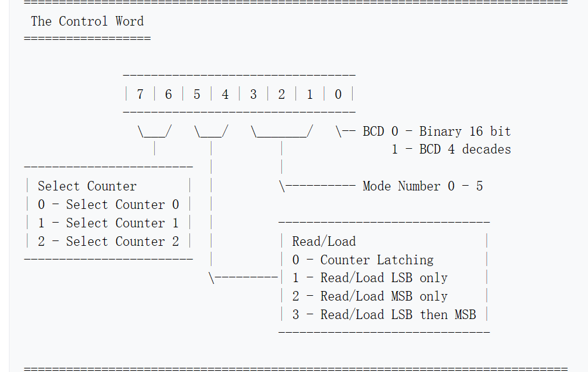
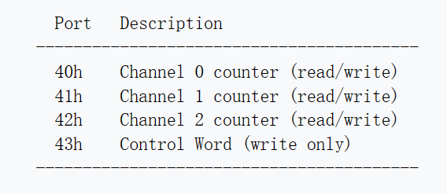
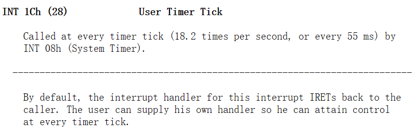
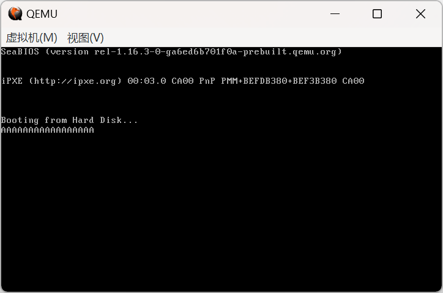

# PA3

本次作业有三步，先设置定时器芯片，定期引发时钟中断；对应的，我们需要时钟中断处理例程；最后把它写入到中断向量表中。

## 设置定时器

```
; 设置8253/4定时器芯片
mov al, 00110110b   ; 必要的设置指令，详解见报告
out 0x43, al        ; 将指令送入8253/4芯片的命令寄存器
```
指令格式如下：



根据格式，其含义为：

1. 设置计数器0
2. 选择Read/Load模式为Read/Load LSB then MSB
3. 选择模式3 — Square Wave Rate Generator
4. frequency number采取十六进制数设置

各个端口的含义如下：


于是我们将指令写入0x43端口中

```
mov ax,0xE90B       ; 设置为约50ms触发一次
out 0x40, al        ; 将低8位送入8253/4芯片的计数器2的数据寄存器
mov al, ah          ; 将高8位送入8253/4芯片的计数器2的数据寄存器
out 0x40, al
```
根据上面的设置，我们来对0号计数器(Counter)的频率进行设置
8253/4芯片的默认频率的是1,193,180Hz，为了使得50ms触发一下，需要把频率设置为20Hz，根据如下公式:

$$frequency = \frac{1,193,180}{frequency  \ \  number}$$

通过调节frequency number，我们可以得到不同的频率，经计算，应设置为59659，转成十六进制为0xE90B。

因为是Read/Load LSB then MSB，所以先写入低位，再是高位。

## 编写中断处理例程

```
int_handler:

    mov cx,[es:0x7DA0]
    inc cx              ; 中断次数加一
    cmp cx,0x14         ; 20次中断，约为1s的时间
    je print

    continue:
    mov [es:0x7DA0], cx
    iret

print:

    ; 输出'A'
    mov ah, 0x0E        ; BIOS功能号
    mov al, 'A'         ; 要显示的字符'A'
    mov bh, 0x00        
    int 0x10            ; 调用BIOS中断
    mov cx,0x0
    jmp continue
```

中断处理例程的编写其实和函数类似，唯一不同的就是调用中断处理例程时，需要对标志寄存器进行保存，对应的ret指令也变为iret。

因为中断的发生频率是50ms一次，所以累计发生20次约为1s的时间，输出一次'A'。我们通过计数中断发生次数进行控制。

这里，我没有直接使用cx寄存器，而是根据编写的512字节的MBR，在其中找了一个空白区域，对应到内存中的地址就是0x00:0x7DA0处，储存了中断发生次数。这一原因会在后面解释。

## 添加到中断向量表中

```
    ; 设置中断向量表
    cli                 ; 关中断
    mov ax, 0           
    mov es, ax          
    mov ax, int_handler 
    mov [es:0x1C*4], ax ; 0x1C处为向量表中定时器有关中断处理例程的位置
    mov ax,0x0          ; 分别将偏移地址(先)和段地址(后)写入对应位置 
    mov [es:0x1C*4+2], ax
    sti                 ; 开中断
```

INT 1Ch的介绍如下：


所以我选择将中断处理例程的入口写在中断向量表的位置，先写偏移地址，再写段地址

但是，如上面的介绍所说，INT 1Ch是通过被INT 08h调用来调用的，而INT 08h在调用时，会把寄存器的值清零，所以之前我选择将计数的值放在内存中，每次读取。

## 实现效果



