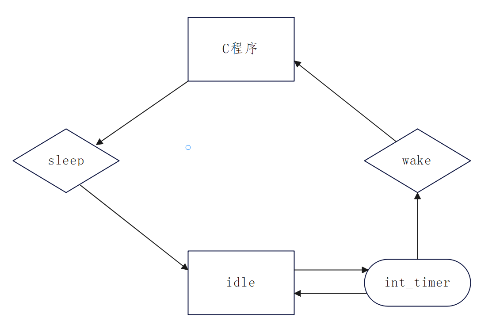
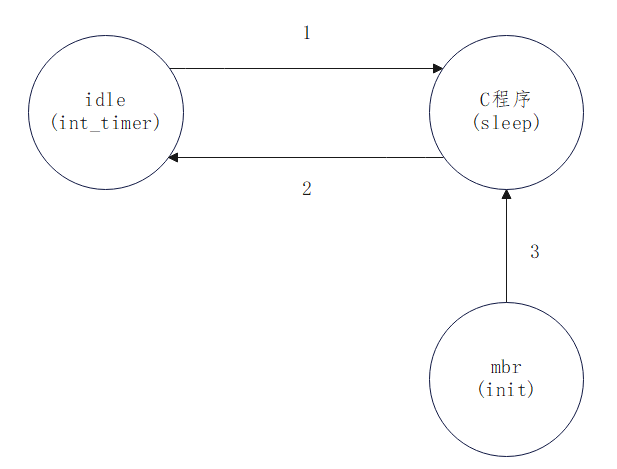
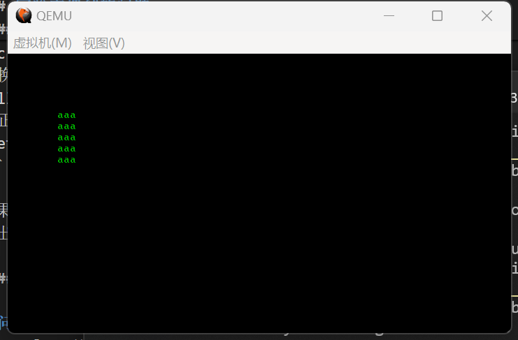

# PA4

本次实验分为以下几步：

1. 编写mbr文件（虽然功能已经完全不同了），其中包括初始化和实现两个系统调用：write和sleep
2. 编写一个C语言程序（下文称app程序），包括.c和.h文件，与以前编写的不同的是，头文件中声明的函数，是在syscall.asm文件中实现的
3. 编写makefile文件，让整个编译过程自动化（学长已经基本提供）

本实验报告将按以上个人理解叙述，与老师的作业布置顺序可能稍有出入，但内容应该是一样的


## mbr文件实现

### 初始化

初始化包含以下几部分：

1. 设置宏定义，代码加载到内存的位置等
2. 初始化寄存器，清屏，设置时钟，设置中断向量表等（与PA3,PA2有关 ）
3. 从内存中读取C语言程序（与PA2有关）
4. 跳转执行C语言程序

我宏定义了如下内容，是几个重要全局变量的内存保存位置：

```nasm
%define app_stack_ss es:0x7DDC
%define app_stack_sp es:0x7DDE

%define idle_stack_ss es:0x7DE0
%define idle_stack_sp es:0x7DE4

%define timer es:0x7DDA
%define sleep_time es:0x7DD8
```

**说明：**

1. app_stack_ss/sp和idle_stack_ss/sp分别是C语言程序和idle程序的栈指针地址，指向栈顶
2. timer是定时器触发的中断次数，sleep_time是sleep时间内所需中断次数

最后的跳转执行部分，是通过构造PSW信息，然后调用iret跳转的，与其他系统调用中的切换方式保持统一，其余的换栈介绍见后。

```nasm
pushf
; C语言程序入口
mov eax,0x0
push eax
mov eax,0x8000
push eax
xor eax,eax
iret 
```

其余部分与前面的实验类似，不再叙述

### 系统调用

通过INT 80H，进入系统调用的入口，然后根据ax的值，进行系统调用的分发。

```nasm
cmp ax,0x1          ;write
je write
cmp ax,0x2          ;sleep
je sleep
```

#### 一号系统调用(write)功能实现

```nasm
write:
    ; 保存寄存器信息
    pushad      
    ; 获取栈指针位置  
    mov ebp,esp
    ; 取参数
    ; 偏移量计算详见报告
    mov eax,[ebp+0x2a]   ; 第一个参数，字符串首地址
    mov ecx,[ebp+0x2e]   ; 第二个参数，字符串长度
    ; 下面的获取光标位置会改变寄存器
    ; 所以保存一下
    push cx
    push ax
    mov ah,3        ; 输入 3 子功能是获取光标位置，需要存入 ah 寄存器
    mov bh,0        ; bh 寄存器是待获取的光标的页号
    int 0x10   
    ; 再恢复
    pop ax
    pop cx
    ; 输出字符串
    mov bl,0x2
    mov bp,ax  		
    mov ah,0x13 	
    mov al,0x01       
    mov bh,0x0 	    
    int 0x10
    popad
    ; 恢复寄存器后，再进行换行操作
    ; dh寄存器记录行数
    inc dh
    ; 换行
    call newline
    ; 正常的中断(系统调用)返回
    iret
```

**取参时的偏移量计算：**

1. pushad压入了8个32位寄存器，偏移 $4\times 8 =32 $ ；
2. syscall.asm的int 80h，压入了标志寄存器，cs和ip寄存器作为返回地址，共计3个16为寄存器，偏移 $ 3 \times 2 = 6 $ ；
3. 再加上C语言程序调用函数时，压入的返回地址eip（因为是段内调用），偏移 $4$ 。
4. 总计偏移40位，写为十六进制就是2ah

只计算了第一个参数的获取，第二个就是在此基础上再偏移4位。
从计算过程的2. 中，我们可以知道，程序的**32位和16位的分野**就在于syscall.asm，C语言程序所使用的是32位寄存器，到了syscall.asm，int 80h中断时，使用的就是16位寄存器了。

其实取参才是关键，后面的都是在复用以前的代码。

#### 二号系统调用(sleep)功能实现

其实，sleep功能的实现，不光包括sleep一个系统调用处理例程的实现，因为还涉及到进程切换的过程，大概可分为三部分：

1. 系统调用(sleep)实现
2. idle进程执行
3. 定时中断与定时切换


<div align="center">
    
</div>

```nasm
sleep:
    ; 保存寄存器
    pushad
    ; 获取栈指针
    mov ebp,esp
    mov ecx,[ebp+0x2a]          ; 获取sleep时间

    ; 设置sleep时间(相乘)
    ; 初始化(置零)中断触发次数
    mov ax,0x14     ; 1秒的中断次数
    mul cx          ; sleep秒数
    mov [sleep_time],ax
    xor cx,cx
    mov [timer],cx

    ; 换栈前记录栈指针位置
    ; 之后换栈
    mov [app_stack_sp],esp
    mov [app_stack_ss],ss
    mov sp,[idle_stack_sp]
    mov ss,[idle_stack_ss]

    popa
    iret
```

读取参数与上面一号系统调用同理，不再解释

我设置的时钟中断是50ms触发一次，一秒理论上触发20次，所以将sleep所需秒数与0x14相乘，结果作为sleep时间内中断触发次数。

换栈相关的更多细节会在下一部分提到。

```nasm
idle:
    ; 因为是从一个中断处理例程中
    ; 跳到idle程序中

    jmp idle
```

idle程序如上，是一个不断循环的程序

时钟中断，在这里起到的是一个定时唤醒程序的作用，好比闹钟。每次时钟中断，将[timer]处的值加一，[timer]和[sleep_time]的值相等时，进入wake程序唤醒。

这里需要注意的是，每一次中断处理结束，以及**最后从wake程序唤醒C语言程序前**，都需要发送EOI信号，告诉可编程中断控制器(PIC)，本次中断结束。否则中断不能连续发生。


### 栈的管理

我本来想实现一个同时有“核心栈 + 用户栈”的程序，但是徐老师说这样比较复杂，而且没有必要。
因此最后，我采纳了徐老师的建议，为app程序和idle程序各构造了一个栈，两个程序在内核态和用户态执行时，其实都是为自己程序服务的，**只有在程序切换（进程调度）时会进行栈的切换**。

```nasm
mov ax,0x2000
mov [idle_stack_sp],ax
; 初始化时所用的栈
mov sp,[idle_stack_sp]

mov eax,0x3000
mov [app_stack_sp],eax

xor ax,ax
mov [app_stack_ss],eax
mov [idle_stack_ss],ax
```

初始化部分，为两个栈指针进行设置，并记录栈指针位置。
其实，在app程序中，它自行更改了sp栈指针，但也不会影响程序正确性，因为我每次换栈，都会更新内存中我记录的栈指针的值。而且Init程序跳到app程序时，栈是空的（iret清栈了），所以没有丢失信息。

关于两个栈是怎么用的，上面部分已经有介绍，这里重点解释**栈的管理是完善的**，即push和pop是对应的：

首先，先放一张状态图

<div align="center">
    
</div>

#### C $\rightarrow$ idle

```nasm

; init
    pushf       ;(a)
    mov ax,0x0
    push ax     ;(a)
    push idle   ;(a)
    pusha       ;(b) 
    mov [idle_stack_sp],sp
    mov [idle_stack_ss],ss

······
······

; sleep
    mov [app_stack_sp],esp
    mov [app_stack_ss],ss
    mov sp,[idle_stack_sp]
    mov ss,[idle_stack_ss]
    popa        ;(b)
    iret        ;(a)

······
······

; int_timer:

    pusha

···
; wake

    ; 此时栈中还有PSW和所有通用寄存器信息
    ; 留待sleep,切换idle时使用
    ; 换栈
```

C语言程序到idle程序的切换，发生在sleep系统调用中，图中**箭头2**。

1. C程序，第一种是从mbr的init函数加载过去的（**箭头3**）；第一种是从上一次的idle转换过去的（**箭头1**）
2. 第一种，从上面的代码标注“**(a)**”处，进出栈是对应的，sleep中PSW信息的push和iret是对应的；第二种，上一次wake程序返回app时，idle栈还存留PSW，留给下一次sleep切换时使用
3. 这样就统一了**箭头1和3**进入的两种app程序，在切换idle时**idle栈中的内容**。通过相同的操作（popa/iret），就可以跳转到idle程序，并还原通用寄存器、符号寄存器的值。
4. sleep程序中，app切换idle时，如果当场构造PSW，符号位是关中断的。如果此时已有app执行前的idle的PSW，那么符号位就是开中断的。这样处理，sti/cli是不需要额外写的。


#### idle $\rightarrow$ C

```nasm

; syscall.asm  myos_write / myos_sleep

    int 80h    ;(a)


; sleep

    pushad     ;(b)
    ···
    ; 换栈
    mov [app_stack_sp],esp
    mov [app_stack_ss],ss
    mov sp,[idle_stack_sp]
    mov ss,[idle_stack_ss]

······
······

; int_timer

    pusha   ;(c)
    ···
    popa    ;(c)
    iret

; wake

    ; 换栈
    mov [idle_stack_sp],sp
    mov [idle_stack_ss],ss
    mov ss,[app_stack_ss]
    mov esp,[app_stack_sp]
    popad      ;(b)
    iret       ;(a)

```

idle到C语言程序的转变，是图中箭头2。idle程序只可能是从sleep程序转来的。代码中标注“(a)”处和“(b)”处，进出栈分别对应。“(c)”处是时钟中断内部的栈管理。


## C语言程序实现

C语言程序只为了测试myos_write()和myos_sleep()，简单编写如下：

```c
#include "myos.h"
int main()
{
    while(1)
    {
        myos_write("aaa",3);
        myos_sleep(1);
    }
}
```

两个函数的声明在myos.h中填写如下：

```c
extern void myos_write(char* s,short l);

extern void myos_sleep(short t);
```

因为是在i8086下运行的，所以传参使用了short,两个函数的实现是在api库中实现的，api库是操作系统向外提供系统调用服务的又一层封装，我这里是syscall.asm

```nasm
BITS 16
section .text
    global myos_write
    global myos_sleep

    myos_write:
        mov eax,1        ; 1号系统调用(write)
        int 80h
        ret

    myos_sleep:
        mov eax,2        ; 2号系统调用(sleep)
        int 80h
        ret
```

其中，对一些语句进行解释：

1. BITS 16 指定了16位编译，虽然编译生成的是ELF32格式文件，但仍要按16位编译，与操作系统兼容
2. section .text ，指定了代码段，这个地方在下面用objcopy提取时会用到
3. global，向外暴露两个函数myos_write()和myos_sleep()，使得C语言程序可以访问到

最后，将这三个文件进行编译，然后提取出代码段和数据段

```
nasm -f elf32 syscall.asm -o syscall.o
gcc -m16 -I. -nostdlib -e main -o main.out main.c syscall.o
objcopy -O binary -j .text -j .data -j .rodata  main.out main.bin
```

**说明：**

1. 这段编译命令是我个人完成作业时使用的，实际makefile里面都包含了相同意思的命令。 
2. .data段中实际是不存在数据的，因为myos_write()函数传的字符串，只是个只读数据，只在 .rodata段中，两个函数中传的short类型参数，都以立即数的形式存在了。

## 其他

### 核心栈与用户栈的尝试

徐老师再次讲解实验之前，我曾尝试写了同时使用核心栈和用户栈的write系统调用例程，后来没有继续推进，转而采用徐老师说的双栈思路。原来的实现展示如下，不做过多解释：

```nasm
print:
    ; 换核心栈并进行状态保存和恢复
    pushad
    mov [app_stack],esp
    mov sp,[os_stack]
    popa
    mov eax,[app_stack]

······    ; 同上面write系统调用的实现

    ; 再次进行换栈、保存、恢复
    pusha
    mov [os_stack],sp
    mov esp,[app_stack]
    popad

    iret
```

### 实验中遇到的问题

#### myos_write()函数输出问题

**问题：**
调用myos_write()时，无法输出正确内容，并且多次调用时，只能输出一行。例如
```
; 期望输出
; "aaa"
; "bb"
; "!"
; 实际输出
; "!ba"
```
**解决：**
问题的原因是寄存器保存与更新出现冲突，

```nasm
popad
; 恢复寄存器后，再进行换行操作
; dh寄存器记录行数
inc dh
; 换行
call newline
; 正常的中断(系统调用)返回
iret
```

如果是先inc dh，再popad，则会导致dh的值无法正常更新，导致多行的内容挤压在一行，所以输出不正确。

#### 时钟中断时无法重复调用

**问题：**
myos_sleep()函数只能调用一次，第二次调用时，可以进入idle程序，但是无法进入时钟中断处理程序
**解决：**
原因在于程序sleep时间到达的最后一次时钟中断处理，程序跳转到wake程序，没有正常结束中断，导致EOI信号没有正常发送。于是下一次使用myos_sleep()函数时，无法调用中断。
因为我一开始使用的是int 1ch中断，所以没有关注这点。需要在中断处理的最后，发送EOI信号就可以解决。

### 经验与心得

**做好版本管理**，每实现一个功能，就尽量保存所有代码。如果之后出现无法恢复的BUG，便于进行版本回滚。否则容易出现写一天，没有一个能跑的demo。


## 实验效果展示

（如果循环时间过长，超出屏幕，会出现显示错误，需要重新清屏和设置光标。我认为这不是本次实验重点，就没有处理）



动态演示效果可以执行mbr.bin来查看