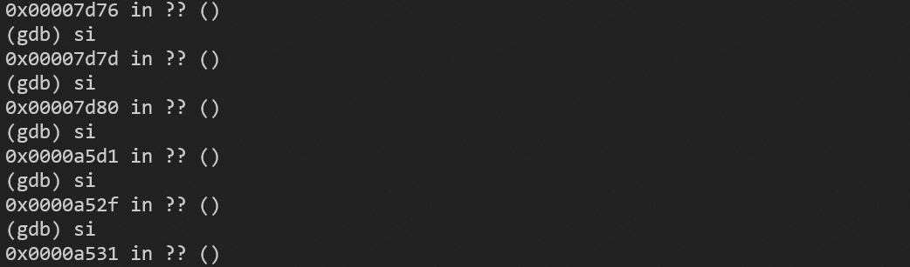
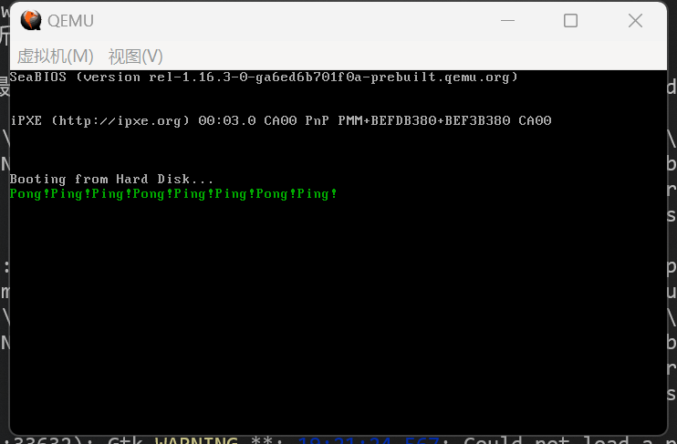

# PA5

本次作业应该是分为两步：
（1）fork一个子进程（2）把子进程纳入之前的调度流程中
但是我之前的调度程序，与sleep和时钟中断处理例程合在一起了，所以我先把调度程序抽离出了一个单独的函数，**改写了之前的调度程序**，再实现本次任务

**节省mbr.bin大小的操作**

mbr.bin的大小实在紧张，在不影响功能前提下，所以我在PA4基础上做了以下处理：

1. 删去了保存切换ss寄存器（后面分段实现又加上了）
2. 有些不必要的32位寄存器操作改为16位寄存器
3. 删去了清屏和换行函数
4. 重写了大量语句，包括内存访问和进出栈
5. pushad/popad改为pusha/popa

因为app程序比较小，所以16位寄存器也是完全够用的

**说明**：

1. 前面都是没用分段实现的，后来又用分段的方法写了一下，放在报告后面了
2. 在代码文件中，kernel_.asm是未分段的写法，kernel.asm是分段的写法

---


**使用的宏定义**

```nasm
; 记录sp指针保存位置
; app_stack_sp1保存父进程的sp，sp2保存子进程的
%define app_stack_sp1 es:0x7002
%define app_stack_sp2 es:0x7006
%define idle_stack_sp es:0x7014
; 分别记录父/子进程的sleep时间
%define sleep_time1 0x7008
%define sleep_time2 0x700C
; cur_pid记录了当前运行程序的pid
; 0x0 idle程序 0x1 父进程 0x2 子进程
%define cur_pid es:0x7020
; 记录了父/子程序是否处于就绪态
; 0x1是处于，0x0是不处于
; f_state记录了父进程状态，s_state是子进程
%define f_state es:0x7022
%define s_state es:0x7024
; 父/子进程程序在内存中的起始位置
%define f_address 0x8000
%define s_address 0xA500
```

## 独立的调度程序

我的调度逻辑是这样的，如果要判断三个进程能不能调度成对方的话，虽然可以实现，但是代码量太大，mbr塞不下。为了**节省mbr空间**我就做了一个形式化的处理，要调度时，**先转成idle的栈**（但是idle程序没有执行，直接进入调度程序了），再去调度


<center>栈的切换示意图</center>

<br>

上图是栈的切换示意图，虽然栈是这样切换的，但是我还要强调的是，调度前换idle栈只是我**代码上的处理**，idle程序并没有执行，而是直接进入scheduler程序了，下面是具体实现

```
scheduler:
    ; cx记录了scheduler程序的返回值
    ; 如果父进程就绪态，换父进程
    cmp [f_state],byte 0x0
    jne shift_1
    ; 如果子进程就绪态，换子进程
    cmp [s_state],byte 0x0
    jne shift_2

    ; 否则还是idle
    mov cx,sp
    ; 这里加0x2是因为scheduler返回时，弹出原地址，要清栈
    add cx,0x2
    ret

    ; 设置信息，切换到父/子进程
    shift_1:
        mov cx,[app_stack_sp1]
        mov [f_state],byte 0x0
        mov [cur_pid],byte 0x1
        ret
    shift_2:
        mov cx,[app_stack_sp2]
        mov [s_state],byte 0x0
        mov [cur_pid],byte 0x2
        ret
```

首先根据 [f_state] 和 [s_state] 判断是否有应用程序处于就绪态，如果没有，就切换为idle程序。cx作为scheduler程序的返回值，给出了下一步要切换到哪个进程。

之所以不再scheduler中切换，而是要以返回值形式给出，是因为如果在函数内切换，如何跳出函数又需要额外代码。注意，如果切换为idle程序，需要cx加0x2，以保持与返回后清栈过的idle栈指针保持一致。

scheduler程序在 sleep 和 int 08h 中是这样被调度的：

```nasm
mov sp,[idle_stack_sp]

; 根据调度的结果换栈
call scheduler
mov sp,cx

; 恢复通用寄存器的值
; 清栈返回
popa
iret
```
先形式化换为idle栈，获得下一步栈指针后，换栈，popa + iret跳入新进程

有了新的调度程序，在sleep和时钟中断程序起始，分别设置sleep时间和记录中断次数，最后在程序末尾都调用一下scheduler函数，实现了调度功能和原来函数的解耦，单独抽象出来了。因为这不是本次作业任务，所以具体改动见代码。

## fork程序与子进程加入调度

具体实现步骤为：

1. 复制父进程的代码段和数据段
2. 栈空间内容转移
3. 构造子进程PSW
4. 根据 [cur_id] ，写一个分情况返回的程序

重点部分的实现如下，其他细节见代码文件：

### 复制构造子进程

先使用rep movsw复制内容，但为了子进程返回到正确位置，需要修改父进程压入的近调用eip，因为父进程调用fork压入的是父进程的调用位置信息;还需要修改返回api调用位置的sp，否则就会从父进程的api返回子进程，这样显然错误了。

```
; 复制代码段和数据段
; 原则上需要复制0x201c个字节
; 所以干脆复制0x2020字节
mov cx,0x2020
mov si,f_address
mov di,s_address
cld
rep movsw
······
; 修改子进程的eip
; 父进程返回为0x802f，所以子进程为0xa52f
mov bp,sp
mov [bp+0x16],word 0xA52f
······
; 0x2500的是父/子进程在内存中起点的差值
mov ax,0x2500
mov bp,sp
add [bp],ax
add ebx,0x2500
```

实测是可以实现的，效果如图，（1）0x7d80是内核中的fork系统调用程序，（2）0xa5d1处是syscall.asm的fork系统调用的api，可以看到，（3）返回到了子进程的0xa52f处继续执行


因为我的子程序起始在0xa500，调用fork()函数的返回处的相对偏移为0x2f，所以我修改eip存储值为0xa52f。
ebx用来访问 .data段的信息，在本次实验中，是访问sleep的具体时间（全局变量a），在切换到子进程时，需要将ebx进行修改。本处是多进程实现的关键，只有两个进程有各自独立的数据段，通过ebx对 .data段的访问才能有区别。
之所以不写更通用的形式(先算出偏移量，再加到子进程地址上)，而是直接改写，是因为我的mbr真的不够了。

### 栈空间转移

```
fork:
    ; 开头存一下
    pusha

; ******** 栈空间复制********
    ; 子进程的栈底设置为0x4000
    ; 0x3FD6+0x2a = 0x4000
    mov bp,sp
    mov cx,0x2a
    mov si,bp
    mov di,0x3FD6
    cld
    rep movsb
```

子进程的栈空间我设置为0x4000，转移0x2a位，即42位的原因如下：

1. fork开头的pusha 16位
2. int 80h，6位，包括符号寄存器、段地址、偏移地址
3. C语言程序的近调用，4位
4. C语言程序中的压栈操作（如下），4次，每次都是32位寄存器，共16位

```
0000020E  6766FF71FC        push dword [ecx-0x4]
00000213  6655              push ebp
00000215  6689E5            mov ebp,esp
00000218  6653              push ebx
0000021A  6651              push ecx
```

### 构造子进程PSW

```
; 换为子进程栈
pushf
mov ax,0x0
push ax
; 子进程回来后，下一步就是分支语句
; 所以直接保存fenzhi的位置
push fenzhi
pusha
; 换为父进程栈
```

在父进程sleep时，调用scheduler程序，然后切换到子进程的栈，根据上述信息，跳转到fork程序的分支返回阶段。

其余的PSW信息，即如何从系统调用返回app子进程，已由先前自行构造；并进行一定修改，以满足子进程需要，如将ebx和返回地址修改为子进程的。


### 分支程序

```
fenzhi:
    ; 根据程序id，走不同的分支
    mov ax,0x2
    cmp ax,[cur_pid]
    je ping
    pong:
        popa
        ; 父进程，返回值大于0
        mov eax,0x1
        iret
    ping:
        popa
        ; 子进程，等于0
        mov ax,0x0
        iret
```
根据 [cur_pid] 的值，分别设置ax作为返回值，

当子进程第一次通过fork的分支程序返回成功，再次进入中断处理的sleep时，就已经可以正常进行调度了，原因见下面的论述

## 栈的完善性与调度

在PA4时我已经论述了栈的完善性，但是我重写了调度程序，所以这里简单介绍一下栈为什么是**完善的**（Push和Pop平衡），已经调度是如何自动化的

1. 栈的push发生在两个地方，一个是初始PSW的构造，三个进程都需要，由我设置，肯定是完善的；第二个地方是程序在调用时钟中断，和应用程序系统调用中断，自动压栈构造PSW，我只负责切换栈，并没有更改，所以也是完善的
2. 调度的起始是手动的，因为需要自行构造初始PSW，比如初始化程序末尾跳转父进程应用程序；但是程序循环运行后，PSW完全交给时钟中断和系统调用中断。
3. 综上，最重要的就是合理构造初始PSW和合理切换栈而不引入改变。这种结构的统一也是因为我改写了调度程序

---

## 分段方式改写

**关于分段地址和改偏移量**

在上面的实现中，我其实也实现了代码段和数据段的分离，主要是通过两点保证的：

1. 对ebx的更改，ebx用来访问数据段
2. 对fork返回子进程时，ip寄存器值的修改，实现访问不同的代码段

改变这两处之后，正常运行时，做好寄存器管理，就可以正常实现进程分离。证据是：（1）加上全局变量后，还可以正常显示，说明内存区分离（2）如之前截图，子进程可以返回到自己的地址区域，代码区分离

我请教了老师，老师说虽然说能实现效果，也没啥错误，但是**不太常规**，所以我还是用段寄存器改写了一下，在我看来用段寄存器改写，就是把**改偏移量变成了分别用不同的段**。

主要有一个问题比较难解决：父/子app进程和系统调用等都有不同的段，如何做好段切换的问题

通过观察，我对分段的处理为：

1. app用ds寄存器访问内存，INT 10h，ah=13h用es寄存器，所以我选择用ds寄存器在系统调用中访问全局变量
2. 其余，如ss，es，cs段寄存器初始化正常设置后，与所运行进程保持一致

具体来说：（1）idle程序，初始化程序，系统调用例程在0x0段（2）父进程在0x800段，子进程在0xb00段

**节省mbr.bin大小的操作**

（在前面的基础上）

1. 改写了许多语句，主要方式是，通过分析代码，将一个赋值语句（比如置零），用于下面多步
2. fork程序复制转移时，将栈空间和代码段、数据段一起复制。因为修改段寄存器（ds,es）还需要先改通用通用寄存器，所以我是修改（si,di）来转移的，效果一样
3. 删去了INT 10h,ah=13h中一些有默认值的，重复设置的语句，如控制页码

### 用到的宏定义

```nasm
; 记录sp指针保存位置
; app_stack_sp1保存父进程的sp，sp2保存子进程的
%define app_stack_sp1 ds:0x7002
%define app_stack_sp2 ds:0x7006
%define idle_stack_sp ds:0x7014
; 分别记录父/子进程的sleep时间
%define sleep_time1 ds:0x7008
%define sleep_time2 ds:0x700C
; cur_pid记录了当前运行程序的pid
; 0x0 idle程序 0x1 父进程 0x2 子进程
%define cur_pid ds:0x7020
; 记录了父/子程序是否处于就绪态
; 0x1是处于，0x0是不处于
; f_state记录了父进程状态，s_state是子进程
%define f_state ds:0x7022
%define s_state ds:0x7024
; 父/子进程程序在内存中的段地址
%define f_address 0x800
%define s_address 0xb00
```

父/子进程的栈分别设置在0x800:0x2500处和0xb00:0x2500处

因为在kernel.asm中，也就是系统调用中，没有用到ds，所以在一进入INT 80h中断时，就把ds设置为0，通过上面的宏定义，作为段寄存器，就可以实现和之前一样的全局变量访问了。

### 系统调用前保护现场

```
; syscall.asm
myos_write:
    push es
    push ds
    mov ax,1       
    int 80h
    pop ds
    pop es
    ret
```

在syscall.asm转到系统调用之前，增加了保存es和ds寄存器的值；之后再恢复

### 父/子进程设置段地址

```nasm
; 父进程（Init）
; 换栈
; 设置cs,ss,ds寄存器
mov ax,f_address
mov es,ax
mov ss,ax
···
mov ds,ax
pushf
push ax
xor ax,ax
push ax
iret 
···
···
; 子进程（fork）
mov bp,sp
mov [bp+0x12],word s_address
mov [bp+0x16],word s_address
mov [bp+0x18],word s_address
```

父进程在跳转之前，设置了段地址；子进程就是在栈空间复制后，把父进程的段地址全部改了一下（都是syscall.asm中保存的现场）

在程序运行时，cs寄存器随iret和int 80h进行保存和恢复；es和ds寄存器在syscall.asm中管理；对于ss寄存器，我是在之前的调度程序基础上，用dx保存将要设置的ss值，并且进行设置（前面提到用cx保存sp的设置的值）。

### es寄存器的处理

还有一点与偏移量时做法不同，就是在write系统调用时，es不是0x0，而是与调用进程的段保持一致。这是因为，在app中（如下），通过esp->ebx->eax的方式来获取字符串的偏移地址，来压栈作为函数参数传参，所以这个偏移量的使用应该与原程序保持一致。
```
0000021C  66E897000000      call dword 0x2b9
00000222  6681C3EA1F0000    add ebx,0x1fea
···
00000243  666A05            o32 push byte +0x5
00000246  67668D83F4EFFFFF  lea eax,[ebx-0x100c]
0000024E  6650              push eax
00000250  66E86A000000      call dword 0x2c0
···
000002B9  67668B1C24        mov ebx,[dword esp]
000002BE  66C3              retd
```
其实，这一点改变，也是采用分段的思路后，很自然的变化

---

## 总结

### gdb使用

本次作业我才开始使用gdb调试，之前配置一直有些问题，这次在**王宇轩**同学的帮助下才成功

对我来说，最大的好处是可以直观的看到栈空间内容和栈指针的变化，一些栈指针的偏移计算也可以通过调试的方法得到验证

但是gdb有一个BUG（至少我这个版本是这样的），比如换到父进程的段时，会发现，内存地址计算只考虑了偏移地址，没算段地址，而且反汇编结果也是错误的。不过好在运行结果正确，而且十六进制的的识别划分位数也正确，只是反汇编不对。


### 段地址

通过（部分）实现分段的方式，认识到了各种段寄存器其实存在协作的关系，并不是独立的，也对各个段寄存器的作用有了更深的了解。
不过，可能是因为PA4没有使用段寄存器的原因，先入为主的原因，所以我还是感觉用改偏移量的方式写比较简单，至少比较直观，但是如果是更多进程的话，估计还是分段比较合理。

### 其他

通过实验，从只复制栈空间到同时复制数据段和代码段，加深了我对于多进程和多线程概念的理解

实验中遇到了很多问题，也在解决问题的同时，学了很多汇编语言的知识和调试的方法，感觉自己可以应对更为复杂的os编程了

## 结果展示




