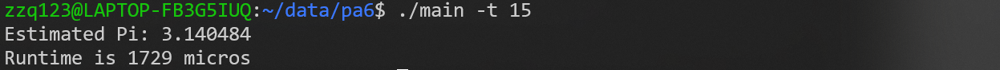
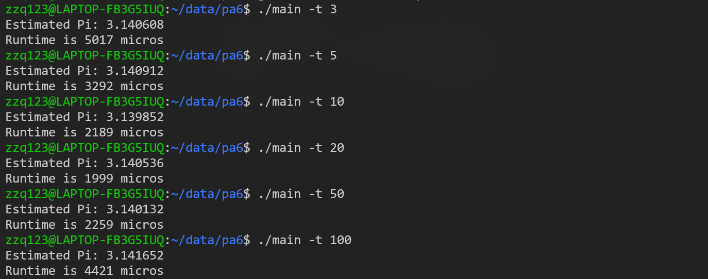

# PA6

本次PA作业比较简单，编写一个多线程程序，采用合适指令编译运行即可
同时，还对随机函数的线程安全性、线程数量与运行时间的关系等进行了实验探究

## 预备知识

在完成作业之前，我先学了C语言语言main函数获取命令行参数的知识，这一部分是我以前学习中遗漏的；还有如何编译和运行一个多线程程序

```c
int main(int argc, char *argv[])
```

argc表示传递给程序的命令行参数的数量；argv是一个字符串数组，里面的每一项就是命令行参数

对于一个多线程的程序，为了保存多线程安全，需要在编译时指定多线程，编译命令为：
```
gcc -o main  main.c -pthread
```
与 -lpthread 相比，-pthread不仅使用了 POSIX 线程库，并且会告诉编译器在编译时使用 POSIX 线程库所需的标志，包括预处理器定义和其他必要的选项，确保程序正确，线程安全

运行命令为
```
./main -t 5
```
其中，5作为线程数给出，可以通过访问argv数组来获取到指定的线程数

## 蒙特卡洛随机采样

蒙特卡洛随机采样是基于概率统计理论，用随机抽样的方法来模拟，给出问题的近似解

在这个问题中，我们是在一个给定大小区域（这里是2$\times$2的正方形）中，通过采样，统计落在圆（这里是单位圆）中的点的个数，根据概率公式：

$$ \frac{落在圆中的点的个数}{总采样数} = \frac{\pi}{2\times2}$$

计算得到$\pi$的估计值

## 多线程程序

大概分为以下几步：

1. 初始化线程数组和锁
2. 创建和运行
3. 结束和销毁
4. 输出结果

### 初始化线程数组和锁

```c
// 获取线程数，创建线程数组
int num_threads = atoi(argv[2]);
pthread_t threads[num_threads];
// 初始化锁
pthread_mutex_init(&mutex, NULL);
```
首先，如前所述，从命令行参数中得到线程数，创建线程数组，初始化锁

### 创建和运行

```c
for (int i = 0; i < num_threads; ++i) {
    pthread_create(&threads[i], NULL, calculate_pi, (void*)(long)num_threads);
}
```

实际创建线程，并且对于每个线程，分配要执行的函数和参数，每个线程开始执行
其中，calculate_pi函数定义如下：

```c
// void* 作为参数和返回值是固定要求
void* calculate_pi(void* arg) {
    // 先计算每个线程采样次数
    long long points_per_thread = total_points / (long)arg;
    long long local_points_in_circle = 0;
    // 线程私有的随机种子，用于随机数生成
    unsigned int seed = time(NULL) ^ pthread_self();  
    for (long long i = 0; i < points_per_thread; ++i) {
        // 生成随机数，并归一化到 -1~1
        double x = (double)rand_r(&seed) / RAND_MAX;
        double y = (double)rand_r(&seed) / RAND_MAX;
        // 根据几何知识判断是否在圆中
        if (x * x + y * y <= 1.0) {
            ++local_points_in_circle;
        }
    }
    // 使用互斥锁更新全局变量，加锁——更改——释放锁
    pthread_mutex_lock(&mutex);
    points_in_circle += local_points_in_circle;
    pthread_mutex_unlock(&mutex);

    return NULL;
}
```

在POSIX库的要求下，多线程函数必须使void*类型作为参数和返回值，这样可以使多线程函数的调用具有一致性。
这段程序，首先是一个蒙特卡洛随机采样的实现，通过rand_r函数获得随机结果，归一化到-1~1区间，根据上面介绍的蒙特卡洛随机采样原理计算$\pi$。
多线程运行下的改变为：
（1）根据线程数，先要计算每个线程采样多少次
（2）读写总的落入圆中次数时，需要用互斥锁（加锁——更改——释放锁）的方式写变量。

### 结束和销毁

```c
// 等待所有线程完成
for (int i = 0; i < num_threads; ++i) {
    pthread_join(threads[i], NULL);
}
```

pthread_join函数阻塞了调用它的线程，使其等待其他线程的执行，保证所有线程都执行完成后，再继续执行
```c
pthread_mutex_destroy(&mutex);
```
销毁锁，完成善后工作

### 输出结果

```c
struct timeval start, end;
gettimeofday(&start, NULL);
···
gettimeofday(&end, NULL);
int microseconds = (end.tv_sec - start.tv_sec) * 1000000LL + 
                    (end.tv_usec - start.tv_usec);
···
// 根据采样结果估计Pi
double pi_estimate = (4.0 * points_in_circle) / total_points;
printf("Estimated Pi: %lf\n", pi_estimate);
printf("Runtime is %d micros\n",microseconds);
```

一个结果是$\pi$的估计值，根据之前提到的公式，稍加变形计算即可
一个是多线程执行时间，单位是微秒，具体实现见上面代码，其实就是结束时间减去开始时间的思路。

结果如下：（线程数为15）


## 随机函数的实现

主要对比的是两个随机函数，rand()和rand_r()
```c
int rand(void);
int rand_r(unsigned int *seedp);
```

rand_r()是一个可重入函数/线程安全的，使用的参数是传入的种子变量，保证了每个线程有自己独立的随机数序列，从而使每个线程之间不会产生冲突和竞争。

而rand()不是可重入函数/线程安全的（各种文档的说法是这样的），它所使用的是一个全局静态变量作为随机种子，如果有多个rand()，它们所使用的种子其实是一个。如果想要保证线程安全性，访问共同的全局变量时，需要额外用互斥锁处理，但这显然是对多线程程序性能有影响的。

虽然说rand()是线程不安全的，但是我查了一下glibc中rand()函数的实现，在早期的版本里面，如v1.09（直到v1.93），确实是线程不安全的，但是在v2.0.2及以上的版本，已经通过加互斥锁的方式改进了，但是通过加/解锁会增加开销，效率毕竟还是不如rand_r()

```c
// rand.c
int
rand ()
{
  return (int) __random ();
}
// random.c
int32_t
__random ()
{
  int32_t retval;
    //早期版本没有锁操作
  __libc_lock_lock (lock);

  (void) __random_r (&unsafe_state, &retval);

  __libc_lock_unlock (lock);

  return retval;
}
```

## 不同线程数的运行时间



通过设置不同的线程数，获得了不同的运行时间，具体结果如上，可以看到：

1. 一定范围内，提高线程数，可以减少程序运行时间，提高效率
2. 如果线程数过多，程序运行时间反而会下降

分析原因可能主要有以下两点：

1. 增加线程数，导致线程频繁地争夺共享资源（如锁），使用互斥锁保护共享变量时，会增加线程间的同步开销，线程数越多，开销越大
2. CPU核数有限，增加线程数导致线程间的竞争CPU资源；如果线程数超出核数，会导致线程上下文切换频繁，从而使每个线程的运行时间延长

我的电脑，CPU核数为8，逻辑处理器数为16（超线程技术），经测试，大概也是15-16个线程时，程序执行速度最快，与第（2）条原因相符

不过，绝大多数情况下，多线程还是要比单独一个线程执行要快速，一个线程执行时间在11000-14000微秒之间

## 总结

通过C语言实现了一个多线程程序，与此同时，也对C语言的命令行参数获取、标准库函数等知识加深了了解。通过实验对比，认识到了多线程在提高效率方面的作用

