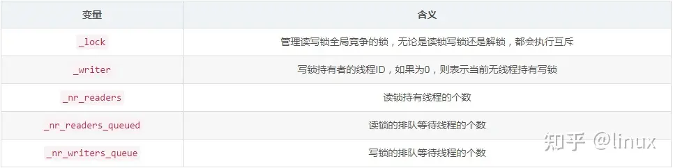
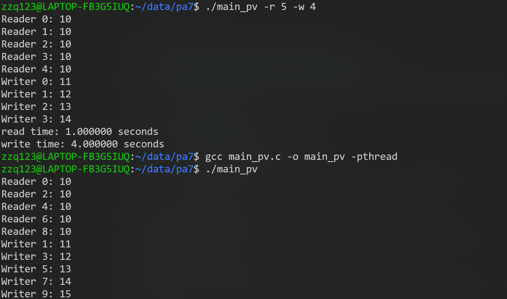
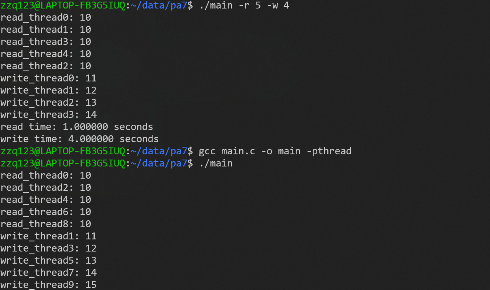

# PA7

作业分为三步：

1. 根据信号量PV操作实现一个读者-写者同步算法，保证读者优先，读写公平
2. 使用pthread中提供的读写锁pthread_rwlock_t实现读写
3. 测试两个方案的表现，并进行分析

## 多线程程序编写

```c
int main(int argc, char *argv[])
// 例如： ./main_pv -r 5 -w 3 ， 读线程5个，写线程3个
```

与PA6一样，使用命令行参数，指定创建读和写线程的数量

```c
clock_gettime(CLOCK_MONOTONIC, &start1); // 记录开始时间
······
clock_gettime(CLOCK_MONOTONIC, &end1); // 记录结束时间
double elapsed_time1 = (end1.tv_sec - start1.tv_sec);
```

使用 pthread_time.h 中的 clock_gettime 方法获取线程运行时间

```c
int number = 10;     // 全局变量，表示临界区资源
```
使用全局变量，作为读和写操作访问的临界区资源

其余的多线程程序编写操作与PA6类似，不再赘述。在下面的叙述中，读者和读操作的线程，写者和写操作的线程是一个意思。

## 基于信号量PV操作的读者-写者同步算法

使用了 semaphore.h 提供的sem_t 作为信号量，为了提高程序的可读性，与课件和课本上给出的伪代码保持一致，对 sem_wait 和 sem_post 进行了换名封装

```c
void P(sem_t* lock){sem_wait(lock); }
void V(sem_t* lock){sem_post(lock); }

// 读者线程函数
void* pth_read(void* arg) {
    long id = (long)arg;

    P(&mutex);
    reader_count++;
    if (reader_count == 1) {  // 第一个读者特殊处理
        P(&write_block);
    }
    V(&mutex);

    // 读操作
    printf("Reader %ld: %d\n", id, number);
    sleep(1);

    P(&mutex);
    reader_count--;
    if (reader_count == 0) {  // 最后一个读者特殊处理
        V(&write_block);
    }
    V(&mutex);

    pthread_exit(0);
}
// 写者线程函数
void* pth_write(void* arg) {
    long id = (long)arg;

    P(&write_block); // 获取写锁
    // 写操作
    number++;
    printf("Writer %ld: %d\n", id, number);
    sleep(1);
    V(&write_block); // 释放写锁

    pthread_exit(0);
}
```

这一部分是核心代码，因为与课本上的伪代码几乎一致，所以具体不过多解释，总结为以下几点：

1. 为了实现读者优先，即只要存在读者，就先由读者进行访问，所以**关键**要对第一个和最后一个读者的访问进行处理（管理write_block），据此判断是否允许写者访问
2. sleep 是模拟了读、写的时间
3. 读操作：根据number的值，进行printf输出；写操作：修改number（number++），为了显式展示写的改变，我也加入了一个printf

结果如下：


分析：

1. 读者可以同时进行读，所以有可能出现执行交错的情况；相反，写者每次只允许一个。这一点从执行时间上也可以看出来
2. 当存在读者时，写者的写操作无法进行，所以所有写操作在所有读操作全部完成后才开始执行。

## 基于pthread_rwlock_t的实现和对比测试

基于 pthread_rwlock_t 的实现，相对来说更加简单，对于读和写不同的操作，上锁的类型不同，如下所示

```c
// pth_read
pthread_rwlock_rdlock(&rwlock);//加读锁
printf("read_thread%ld: %d\n",pid,number);
sleep(1);
pthread_rwlock_unlock(&rwlock);  
···
// pth_write
pthread_rwlock_wrlock(&rwlock);//加写锁
number++;                      //对临界区变量进行修改(写操作)
printf("write_thread%ld: %d\n",pid,number);
sleep(1);
pthread_rwlock_unlock(&rwlock);  
```

我查阅了一些介绍 pthread_rwlock_t 的博客，查看了一下 pthread_rwlock_t 的定义

```c
typedef union
{
# if __WORDSIZE == 64
  struct
  {
    int __lock;
    unsigned int __nr_readers;
    unsigned int __readers_wakeup;
    unsigned int __writer_wakeup;
    unsigned int __nr_readers_queued;
    unsigned int __nr_writers_queued;
    int __writer;
    int __shared;
    unsigned long int __pad1;
    unsigned long int __pad2;
    /* FLAGS must stay at this position in the structure to maintain
       binary compatibility.  */
    unsigned int __flags;
  } __data;
// 限于篇幅，只展示了__WORDSIZE == 64 的，另一部分与此类似
  char __size[__SIZEOF_PTHREAD_RWLOCK_T];
  long int __align;
} pthread_rwlock_t;
```


关于 pthread_rwlock_t 的读/写优先级策略，有多种：

```c
PTHREAD_RWLOCK_PREFER_READER_NP, //读者优先
PTHREAD_RWLOCK_PREFER_WRITER_NP, //也是读者优先
PTHREAD_RWLOCK_PREFER_WRITER_NONRECURSIVE_NP, //写者优先
PTHREAD_RWLOCK_DEFAULT_NP = PTHREAD_RWLOCK_PREFER_READER_NP
```

默认是读者优先的方式，这与我下面的测试结果是一致的

### 测试结果

使用 pyhread_rwlock_t 方式实现的，可执行文件为main；信号量PV操作实现的，可执行文件为 main_pv，我用了两种方式测试

一种是正常创建读进程组，和写进程组；一种是交叉创建读/写进程，排除创建顺序的影响，方式如下：

```c
// 方式一
//创建读者线程
for (long i = 0; i < num_read_threads; i++) {
    pthread_create(&readers[i], NULL, pth_read, (void*)i);
}
// 创建写者线程
for (long i = 0; i < num_write_threads; i++) {
    pthread_create(&writers[i], NULL, pth_write, (void*)i);
}
// 方式二
// 这样创建的读者/写者是交替的，会出现写者在读者后创建的情况
// 可以更好地测试读者优先的效果
for (long i = 0; i < 10; i++) 
{
    if(i%2==0)
    pthread_create(&threads[i], NULL, pth_read, (void*)i);
    else
    pthread_create(&threads[i], NULL, pth_write, (void*)i);
}
```



结果如上所示，是一致的，都是读者优先策略

1. 读锁可以由多个读者重复获取，所以会出现不同的线程执行完成顺序打乱的情况
2. 读者优先，体现在只要有读者存在，写操作只能在读操作全部完成后执行；对于第二种方式的测试，可以看到，后创建的读线程会在写线程之前全部完成