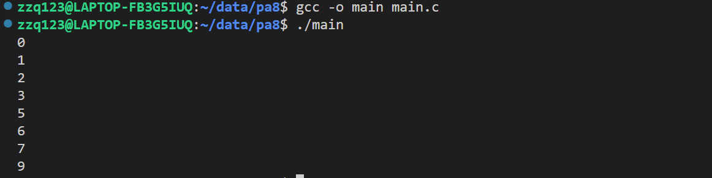
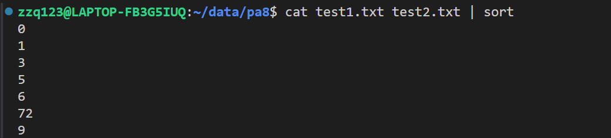
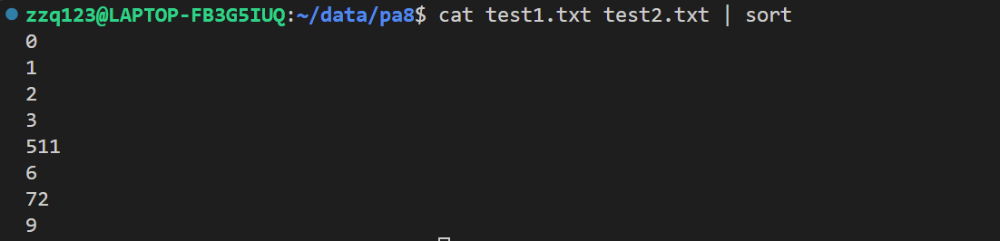

# PA8

本次作业分为如下几部分：

1. 创建第一个子进程，负责执行cat 命令
2. 创建第二个子进程，负责执行sort 命令
3. 为了实现数据共享，需要进行进程间通信，采用管道和重定向技术


## 子进程1

```c
pid1 = fork();

if (pid1 == 0) {
    // 子进程1: 执行cat
    close(pipefd[0]);   // 关闭读端

    // 将标准输出重定向
    // 实际就是将cat要输出的内容截取，放到管道里
    dup2(pipefd[1], STDOUT_FILENO);

    close(pipefd[1]);   // 关闭写端

    // cat命令实际上自己可以打开和关闭文件
    // int fd1 = open("test1.txt", O_RDONLY);
    // int fd2 = open("test2.txt", O_RDONLY);

    char *cat_args[] = {"cat", "test1.txt", "test2.txt", NULL};
    execvp("cat", cat_args);// 使用 execvp 执行 "cat"

    // close(fd1);
    // close(fd2);
} 
```

首先，因为cat 命令的输出结果要通过管道传送，所以这里先将 STDOUT_FILENO 进行了一个重定向操作，因为读端是不用的，所以直接关闭掉了

exec函数族可以赋予进程全新的功能，其中execvp的函数原型为：

```c
int execvp(const char *file, const char *argv[]);
```

其中，file 是加载的程序的名字，这里是"cat"；argv 是命令行参数，这里通过 cat_argv进行了构造

cat 命令实际可以自行打开和关闭文件，所以其实open 和 close 是不必要的

因为老师没有说"cat" 命令能不能直接调用，所以我用open、write系统调用也实现了一下

```c
// 关闭读端
close(pipefd[0]);

int fd1 = open("test1.txt", O_RDONLY);
int fd2 = open("test2.txt", O_RDONLY);

// 读取文件内容并写入管道
char buffer[BUFFER_SIZE];
ssize_t bytesRead;

while ((bytesRead = read(fd1, buffer, BUFFER_SIZE)) > 0) {
    write(pipefd[1], buffer, bytesRead);
}

while ((bytesRead = read(fd2, buffer, BUFFER_SIZE)) > 0) {
    write(pipefd[1], buffer, bytesRead);
}

close(fd1);
close(fd2);
close(pipefd[1]);
```

首先先 open 系统调用打开文件，使用 read 系统调用将 .txt 文件中的内容读入到 buffer 里面，作为缓冲，然后再通过 write 系统调用和管道的写端，将内容写入管道。

虽然，我这里说是系统调用，但其实C语言库已经对其进行了一定的封装。

## 子进程2

```c
pid2 = fork();

if (pid2 == 0) {
    // 子进程2: 执行sort

    close(pipefd[1]);  // 关闭写端

    // 将标准输入重定向
    // 接受刚才写入数据
    dup2(pipefd[0], STDIN_FILENO);

    close(pipefd[0]);  // 关闭读端

    char *sort_args[] = {"sort", NULL};
    execvp("sort", sort_args);// 使用 execvp 执行 "sort"

    // 因为子进程2的标准输出没有被重定向
    // 所以sort 的结果就输出到命令行中了
}
```

因为这里不需要管道的写端，所以先关闭了，然后通过输入重定向，使子进程2可以接收到管道内的子进程1写入的信息。

再次通过 execvp 函数，调用了sort 命令

因为此时的子进程2 的标准输出没有重定向，所以就输出到命令行中了

## 结果




## 其他

在实验中，我发现，如果test1.txt文件不以换行符 "\n" 结尾，则排序结果会出现异常，如下所示




查阅了一些资料后发现，默认情况下 sort 函数是将一整行的数据作为一个单位进行排序，如果我在 test1.txt文件末尾没有换行符的话，7就会和test2.txt文件的开头2合在一起，组成“72”。此时我才注意到，教学立方老师给的例子末尾是有明显换行符的。

而“72”没有显然是比这几个个位数要大的，它没有排到最后一位的原因，是因为sort 函数是根据字典序进行排序的，所以优先比较了第一位的顺序

这一点我也进行了测试，将test1.txt 的内容改为

```c
// 结尾有换行符
0
3
511
72

```

排序结果为：


